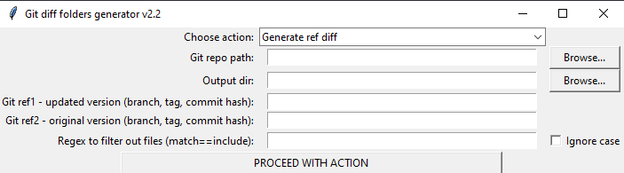

# Diff generator

Simple python app with GUI based on tkinter library that generates folder structure containing original and updated files based on provided git references.

**User has to provide inputs:**
1. git root repo path
2. output folder
3. reference 1 - updated (branch name, tag, commit hash) 
4. reference 2 - original (branch name, tag, commit hash)
5. click on generate button

**Output:** program generates two subfolders representing diff between provided references with structure of added/modified/renamed/deleted files with respect to git repo root folder 

# Developer guide
1. pipenv update (creates virtual environment, install packages)
2. run deploy_application.bat to generate EXE file in "dist" subfolder

# Changelog

## v1

### Added
- single function for generating diff between two given references

## v2

### Added
- function for generating merge diff (3-way merge) (GENERATE MERGE DIFF button); resulting folder structure creates 3 folders:
    - Base - common ancestor, 
    - Head - current version of file, 
    - Merge_head - version of file from reference you are merging

## v2.1

### Added
- option to generate empty files to match all output folders structure 1:1
- generate README.txt in root_output_folder with list of files within output structure

## v2.2

### Added
- selection of action by dropdown menu
- disabling unneeded entries for "generate merge diff" action
- version number in the ttile window